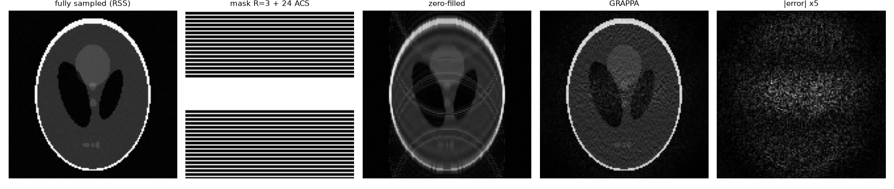
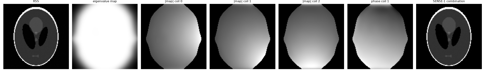
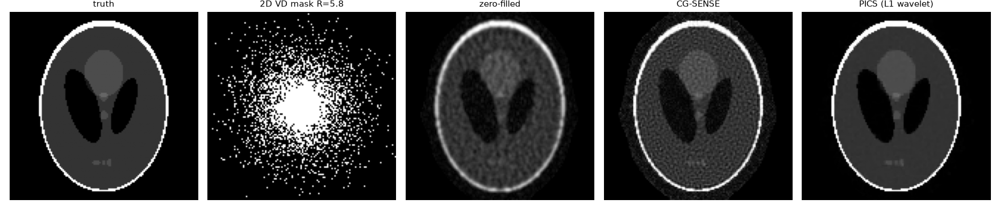
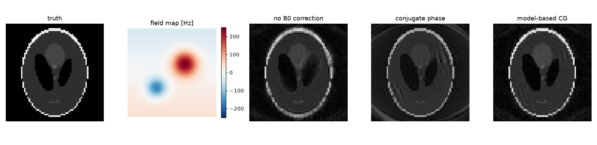
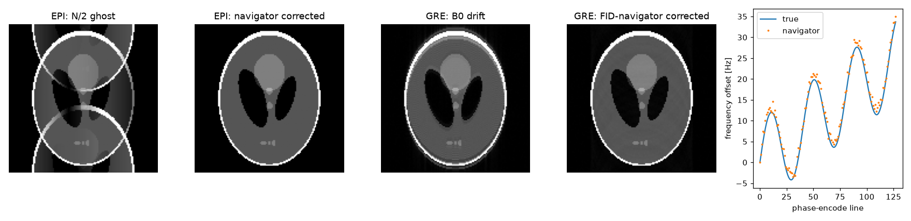
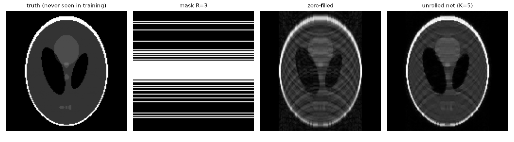

# MRI reconstruction tutorials

Six short, self-contained Python scripts that implement the core MRI
reconstruction methods **from scratch** on simulated data, so every line can be
read and changed. No vendor data, no black boxes: NumPy for the classic
methods, PyTorch for the deep-learning one.

| # | Script | Method | Result on the simulated data |
|---|---|---|---|
| 01 | [`01_grappa.py`](01_grappa.py) | GRAPPA (k-space parallel imaging) | R=3, 8 coils: NRMSE 0.29 -> 0.18 (the rest is g-factor noise) |
| 02 | [`02_espirit.py`](02_espirit.py) | ESPIRiT coil maps from the calibration region | maps within 0.9 % of the true sensitivities |
| 03 | [`03_pics.py`](03_pics.py) | PICS: SENSE + L1-wavelet, FISTA | R=5.8: CG-SENSE 0.25 -> PICS 0.06 |
| 04 | [`04_b0_correction.py`](04_b0_correction.py) | B0 (off-resonance) correction for spirals | no correction 0.43 -> model-based CG 0.26 |
| 05 | [`05_phase_frequency_correction.py`](05_phase_frequency_correction.py) | EPI N/2 ghost + B0-drift correction with navigators | ghost removed; drift estimated to 1.4 Hz rms |
| 06 | [`06_dl_unrolled.py`](06_dl_unrolled.py) | Unrolled network (MoDL-style) with data consistency | R=3 single coil: 0.37 -> 0.22, tested on an unseen phantom |

NRMSE: normalised RMS error against the ground truth after the best global scaling.

```bash
pip install -r requirements.txt
python 01_grappa.py        # each script writes its figure to figures/
```
Each script runs in a few seconds; 06 trains a network for about 2-4 minutes
(Apple-silicon GPU, CUDA or CPU are picked automatically).

---

## 01 - GRAPPA


Coil sensitivities are smooth, so in k-space they act as a small convolution
kernel: every missing line is a linear combination of its acquired neighbours
in all coils. The weights (2 rows x 3 columns x 8 coils per target point) are
fitted with regularised least squares on the fully sampled centre (ACS) and
applied everywhere. The remaining error is noise amplification (g-factor),
largest in the centre where the coils overlap the least.

## 02 - ESPIRiT


1. Slide a 6x6 window over the calibration data of all coils -> calibration matrix.
2. Keep its signal subspace (singular values above 2 % of the largest).
3. Move those kernels to image space; at every pixel the nc x nc matrix has an
   eigenvector with eigenvalue ~1 -> that is the coil sensitivity there.
   Pixels without such an eigenvalue are outside the object and are masked.

The eigenvalue map is a free object mask. The trap: the calibration matrix
holds patches (a correlation), so the image-space eigenvectors come out
conjugated; the script checks the result against the true maps.

## 03 - PICS (parallel imaging + compressed sensing)


`argmin_x 1/2 ||M F S x - y||^2 + lambda ||W x||_1` with ESPIRiT maps S and an
orthonormal Haar wavelet W, solved with FISTA. A 2D variable-density random mask
(think ky-kz of a 3D scan) makes the aliasing incoherent; CG-SENSE alone
amplifies noise, the sparsity term removes it. Haar is not shift invariant, so
a random shift per iteration (cycle spinning) avoids blocky results.

## 04 - B0 correction for spirals


With an off-resonance map f(r), the signal picks up exp(-i 2 pi f(r) t) during
the 12 ms spiral readout and every pixel with |f| > 0 is blurred. The encoding
matrix is built explicitly (64x64), so the comparison is exact:
*conjugate phase* (the adjoint of the full model with density compensation; fast but
approximate) and *model-based CG* (solves the full model). On a real scanner the
same model is applied with a NUFFT and time segmentation.

## 05 - Phase and frequency correction


**EPI ghost.** Opposite readout polarities on odd/even lines plus a small
gradient delay give a linear phase in hybrid (x, ky) space -> a ghost at FOV/2.
Three navigator echoes without phase encoding give phi0 + phi1 x by a weighted
linear fit; removing it removes the ghost.

**B0 drift.** Gradient heating and breathing move the frequency by a few Hz during
the scan. A short FID navigator per TR gives df from its phase; every sample is
demodulated with exp(-i 2 pi df t), which fixes the phase-encode ghosting and the
readout shift together.

## 06 - Deep-learning reconstruction (unrolled network)


Five iterations of *CNN denoiser* -> *exact data consistency*, with shared
weights and a learned data-consistency weight. Trained only on random ellipses and
tested on the Shepp-Logan phantom: the data-consistency step is what lets a
tiny network generalise to an image it has never seen. Small on purpose; the
same structure scales to multi-coil data by replacing the closed-form step with a
few CG iterations on the SENSE model.

---

## Files
```
mrutils.py      phantom, coil maps, centred FFTs, sampling masks, NRMSE, plotting
01..06_*.py     one method each, runnable on their own
figures/        output of the scripts
```

## Requirements
Python >= 3.10, numpy, matplotlib, torch (only for 06).

## References
* Griswold et al., *GRAPPA*, MRM 47:1202 (2002)
* Uecker et al., *ESPIRiT*, MRM 71:990 (2014)
* Lustig, Donoho, Pauly, *Sparse MRI*, MRM 58:1182 (2007)
* Sutton, Noll, Fessler, *Fast iterative image reconstruction with field inhomogeneity*, IEEE TMI 22:178 (2003)
* Aggarwal, Mani, Jacob, *MoDL*, IEEE TMI 38:394 (2019)

## Licence
MIT
